Teletekst

---

<!---
header: 100
-->

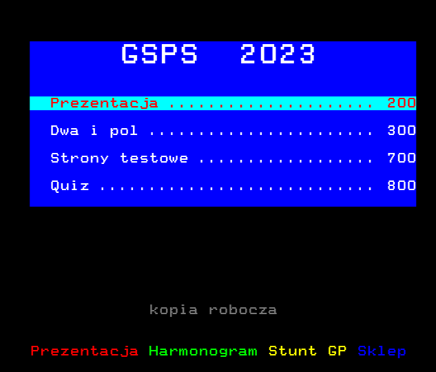

---

<!---
header: 200
-->

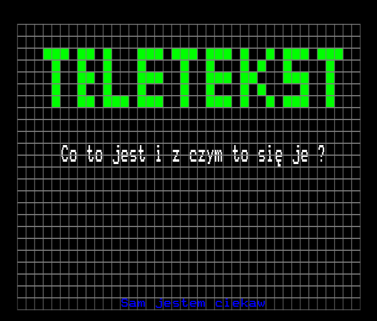

---

<!---
header: 201
-->

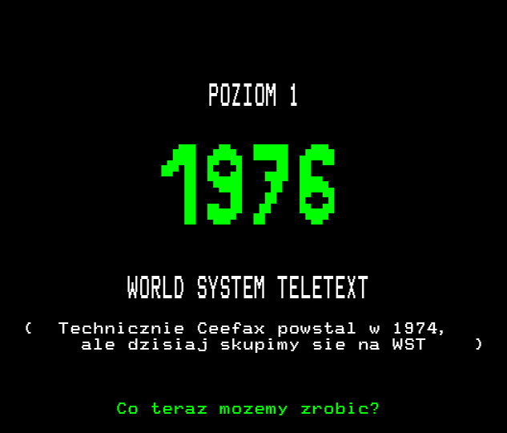

---

<!---
header: 202
-->

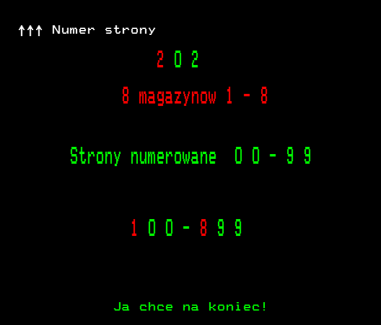

---

<!---
header: 898
-->

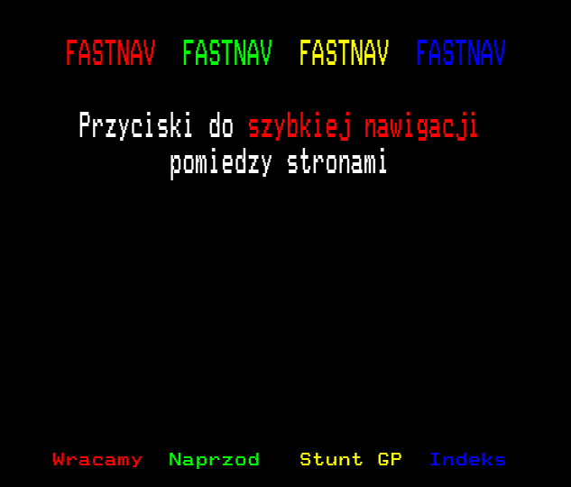

---

<!---
header: 899
-->

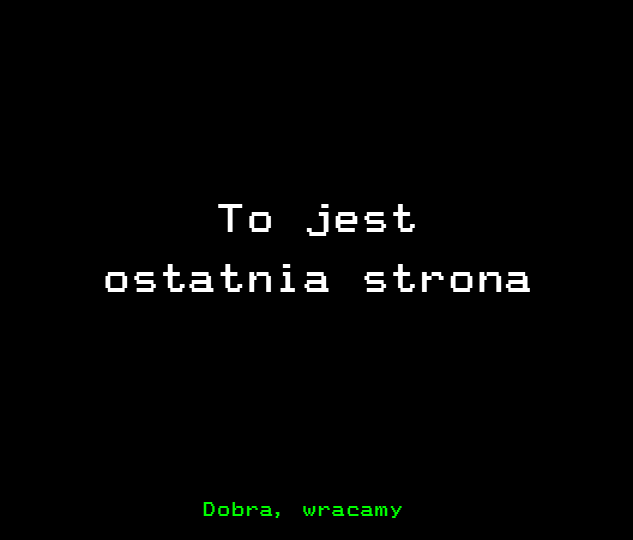

---

<!---
header: 89A
-->

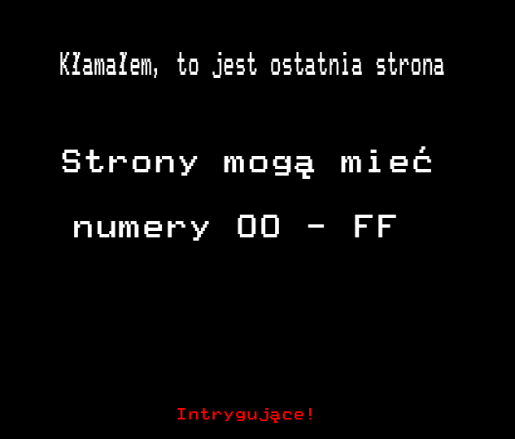

---

<!---
header: 203
-->

## 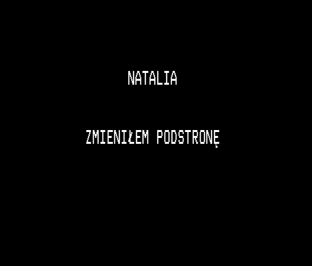

## 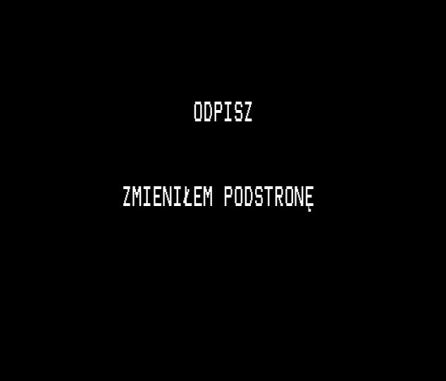

---

<!---
header: 204
-->

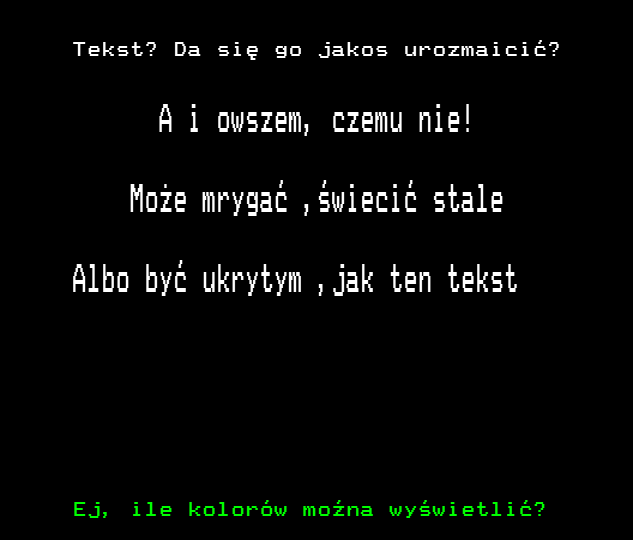

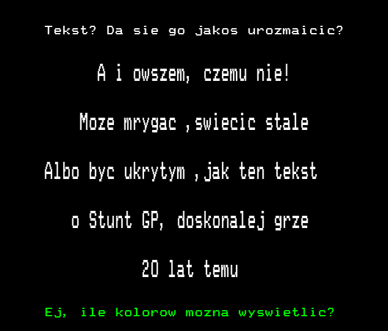

---

<!---
header: 205
-->

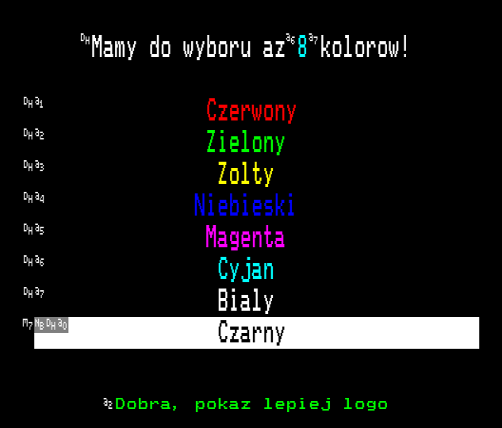

---

<!---
header: 206
-->

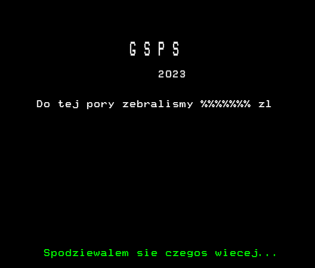

---

<!---
header: 207
-->

---

<!---
header: 208
-->

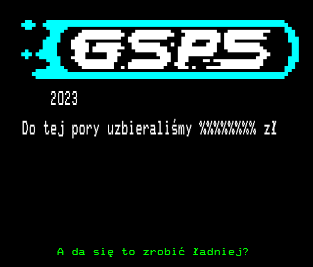

---

<!---
header: 702
-->

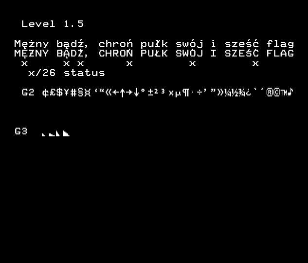

---

<!---
header: 209
-->

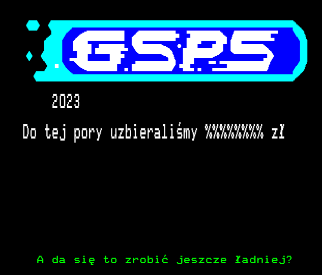

---

<!---
header: 210
-->

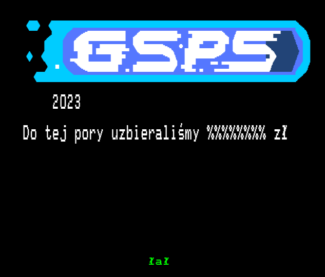

---

<!---
header: 300
-->

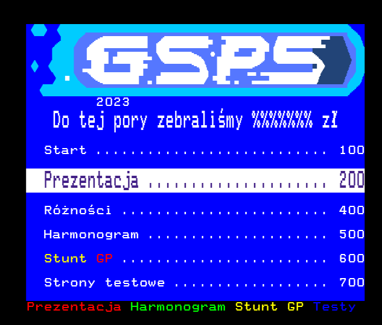

---

<!---
header: 301
-->

